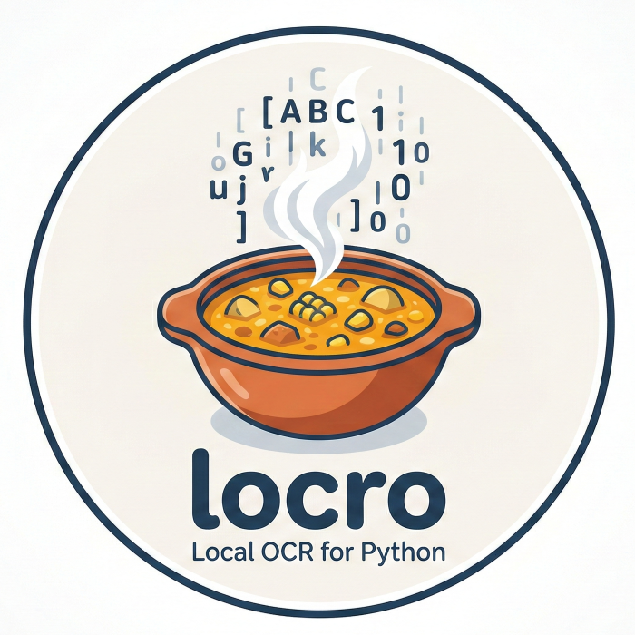

# locro

<p align="center">
  
</p>

This is a Python wrapper for Chrome's built-in **screen-ai** OCR engine. This engine is *extremely fast* compared to other alternatives (Tesseract, etc.) and *very* accurate (particularly for extracting text; less so when dealing with complex layouts such as tables and forms). However, it is only available through Chrome/Chromium. The magic of this wrapper is that it allows you to call the `screen-ai` library directly from Python (using ctypes), without having to open browser windows.

It works on **Windows** (`chrome_screen_ai.dll`), **Linux** (`libchromescreenai.so`), and **macOS** (`libchromescreenai.so`).

Lastly, it supports both PDFs and images (JPG, PNG, WebP, BMP, TIFF, GIF).

## Quick start

To install this library, simply clone it and then install it from the local folder:

```bash
pip install -e .           # install
locro download             # (optional) one-time: copy library + models from Chrome
locro ocr document.pdf     # process a PDF
locro ocr photo.jpg --text # process an image
```

See [GUIDE.md](GUIDE.md) for the full user guide, including installation, CLI, and API documentation.

See [CHROME_SCREEN_AI_DLL.md](CHROME_SCREEN_AI_DLL.md) for technical details on
how the library interface was reverse-engineered.
