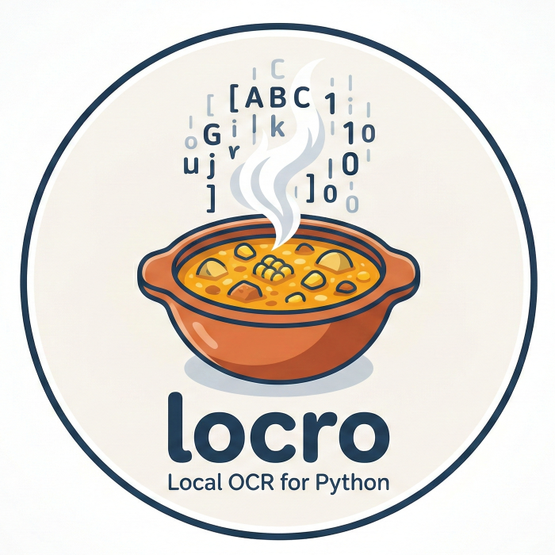

# locro

<p align="center">
  
</p>

This is a Python wrapper for Chrome's built-in **screen-ai** OCR engine. This engine is *extremely fast* compared to other alternatives (Tesseract, etc.) and *very* accurate (particularly for extracting text; less so when dealing with complex layouts such as tables and forms). However, it is only available through Chrome/Chromium. The magic of this wrapper is that it allows you to call the `screen-ai` library directly from Python (using ctypes), without having to open browser windows.

It works on **Windows** (`chrome_screen_ai.dll`), **Linux** (`libchromescreenai.so`), and **macOS** (`libchromescreenai.so`).

Lastly, it supports both PDFs and images (JPG, PNG, WebP, BMP, TIFF, GIF), including non-Latin scripts (Devanagari, Arabic, Cyrillic, ...) in searchable-PDF output.

## Quick start

To install this library, simply clone it and then install it from the local folder:

```bash
pip install -e .           # install
locro download             # (optional) one-time: copy library + models from Chrome
locro ocr document.pdf     # process a PDF
locro ocr photo.jpg --text # process an image
```

To build searchable PDFs with non-Latin text (e.g. Devanagari), install the
bundled Noto Sans font from the [fonts/](fonts/) folder (one-time):

- **Windows:** right-click `fonts/NotoSans-VariableFont_wdth,wght.ttf` and choose **Install** (or **Install for all users**).
- **macOS:** double-click the font file and click **Install Font** in Font Book.
- **Linux:** copy it to `~/.local/share/fonts/` and run `fc-cache -f`.

Noto Sans covers Latin, Cyrillic, Greek and Devanagari; Arabic, CJK and other
scripts need their own Noto font (e.g. `NotoSansKR-Regular.ttf` for Korean).

See [GUIDE.md](GUIDE.md) for the full user guide, including installation, CLI, and API documentation.

## Batch & parallel OCR

Point `ocr` at multiple files, a folder, or both -- and add `-j` to OCR several
files at once (each in its own process, since the underlying OCR library
isn't safe to share across threads):

```bash
locro ocr document.pdf                      # single file
locro ocr a.pdf b.pdf c.pdf -j 3            # several files, 3 in parallel
locro ocr ./scans -j 4                      # every PDF/image directly inside a folder
locro ocr ./scans -j 4 -s ./searchable      # + a searchable PDF per file, named <name>_searchable.pdf
locro ocr ./scans -j 4 -o ./results -s ./searchable  # custom output: ./results/txt, ./results/json, ./searchable
```

`-s`/`--searchable-pdf` also writes the usual `_ocr.txt`/`_ocr.json` pair
alongside the searchable PDF -- you don't need a separate run for both. With
multiple input files, output goes to `./ocr_output/txt` and `./ocr_output/json` unless you
pass `-o <dir>` (which uses the same `txt`/`json` subfolders); a single file without `-o` still writes next to the input. With
multiple input files it's treated as an output *directory* rather than a
single filename.

### Generating a word index from OCR output

`locro_parse_ocr.py` turns the per-book `_ocr.json` files into line-level CSVs
and word-level JSON (with bounding boxes), which is what you need to build a
word index:

```bash
python .\locro_parse_ocr.py --ocr-results .\results\json\ --output .\parsed_output_locro
```

`--ocr-results` points at the folder of `_ocr.json` files (e.g. the `json/`
subfolder produced by `locro ocr -o`), and `--output` is where the parsed
results go. Use `--book <name>` to process a single book. For each book it
writes `<book>/<book>_lines.csv`, `<book>/<book>_words.json` and
`<book>/<book>_words_trimmed.json`.

### Building searchable PDFs from parsed output

`make_searchable_pdf.py` takes the parsed `<book>_words.json` files plus the
original scanned PDFs and writes searchable PDFs, with each word placed as
invisible text at its bounding box. It works with the output of either
`docai_parse_ocr.py` or `locro_parse_ocr.py`:

```bash
python .\make_searchable_pdf.py --scans .\scans --parsed .\parsed_output_docai --output .\searchable_docai
```

`--scans` is the folder of original `<book>.pdf` files (the file name must
match the book name), `--parsed` is the parsed output folder (use
`.\parsed_output_locro` for locro output), and `--output` is where
`<book>_searchable.pdf` is written. Use `--book <name>` to process a single
book. Non-Latin text uses the bundled Noto Sans font from [fonts/](fonts/), so
no font install is needed for this step.

See [CHROME_SCREEN_AI_DLL.md](CHROME_SCREEN_AI_DLL.md) for technical details on
how the library interface was reverse-engineered.
